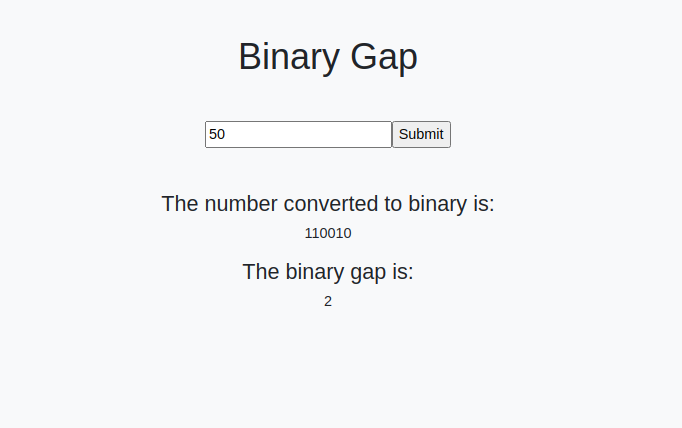

# Binary Gap

> This web app allows users to enter integers and returns it converted to binary and its Binary Gap (longest amount of consecutive zeros).

Additional description about the project and its features.

## Built With

- JavaScript
- Nodejs
- Webpack
- Bootstrap

## Live Demo

[Live Demo Link](https://jssarrazolaa.github.io/Binary-Gap/)

## Getting Started

To get a local copy up and running follow these simple example steps:

- Run this command in your terminal `https://github.com/jssarrazolaa/Binary-Gap.git`

## Ruby executable

To try the Ruby version of the code follow these steps:

- Go to the root folder of the project
- Run `chmod 755 binary` to give executable permission in your machine
- Run `/binary`, enter a number and you will see the same response

### Prerequisites

- Ruby
- Nodejs
- Bootstrap

### Install

> Go to https://nodejs.org/en/ and follow the steps there to install Nodejs.
> Got to https://www.ruby-lang.org/en/downloads/ and follow the steps there to install Ruby.

## Authors

👤 **Author1**

- GitHub: [@jssarrazolaa](https://github.com/jssarrazolaa)
- Twitter: [@StevenAlvarez_](https://twitter.com/StevenAlvarez_)
- LinkedIn: [Jhonatan Sarrazola](https://www.linkedin.com/in/jhonatansarrazola/)

## 🤝 Contributing

Contributions, issues, and feature requests are welcome!

Feel free to check the [issues page](https://github.com/jssarrazolaa/Binary-Gap/issues).

## Show your support

Give a ⭐️ if you like this project!

## Acknowledgments

- The Odin Project
- Microverse
- OpenWeatherMap

## 📝 License

This project is [MIT](lic.url) licensed.
